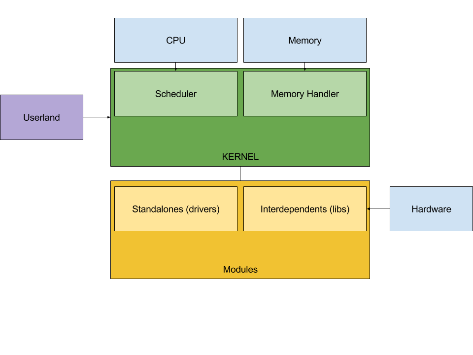

Architecture
============

Module Specific header
======================

| Address | Size | Description |
|---------|------|-------------|
| 0       | 1    | Type ( 8 bits for the general type of the module <driver, FS, shared lib...>, 8 bits for the HW type if it is a driver, else it can be a major versionning system) |
| 1       | 2    | HW Manufacturer ID (can be null). Specific for drivers, to let the kernel know on which hardware they work |
| 3       | 1    | Number of exposed functions (n) |
| 4       | n    | Exposed functions (API) |

Binary header
=============
| Address       | Size   | Description |
|---------------|--------|-------------|
| 0             | 1      | Magic code (0xF057) (which is replaced after loading by the number of modules/threads dependent on this binary) |
| 1             | 1      | Size of relocation table (n) |
| 2             | 1      | Size of binary (b) |
| 3             | 1      | Size of additional data (d) |
| 4             | 1      | Size of table dependencies ID (i) (can be 0) |
| 5             | i      | Table dependencies |
| 5 + i         | n      | Relocation table |
| 5 + i + n     | d      | Additional data |
| 5 + i + n + d | b      | Binary data |

Thread
======

| Address | Size | Description |
|---------|------|-------------|
| 0       | 1    | PID |
| 1       | 1    | PID parent |
| 2       | 1    | SP saved |
| 3       | 1    | Kernel SP saved |
| 4       | 1    | Time elapsed since the beginning of the thread |
| 5       | 1    | CPU Time left for this round |
| 6       | 1    | Priority |
| 7       | 8    | Name |
